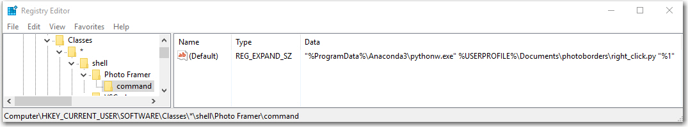

# Photo Borders

A utility to create coloured borders around photos and images by taking colour samples from the image


## Getting Started

1. [Visual studion code](https://code.visualstudio.com/download) from Microsoft
1. [Anaconda Python 3.x](https://www.anaconda.com/download/)Python 3.6 version
1. [Git for windows](https://git-scm.com/download/win) to get the sources on your PC. 

Open a command shell (dos) windows (cmd followed by enter )and change to the current use document folder:

``` 
cd %USERPROFILE%\Documents
```

From here run the following command: 

```
git clone https://github.com/G00364778/photoborders.git
```

Optional: Now right click on the new folder and select "Open With Code" to view the scrips.

Add the explorer right click features using the included "right_click.reg" file by double clicking this file. 
This allows you to run the script using right click from windows explorer in a jpeg file.

```
1. Open the "photoborders" folder created by git clone
1. Find the file "right_click.reg" inthe folder
1. Double click the file and accept the prompts from windos adding this feature.
```
The resulting registy entries added looks like this:




The right click feature should now show up in the windows explorer context menu by right clicking on a jpeg file.


### Prerequisites

* [Visual Studio code](https://code.visualstudio.com/download) - Python IDE for Windows
* [Anaconda Python 3.x](https://www.anaconda.com/download/) - Python Modules from Anaconda distribution. 
* Git/Github - Extension for VSC will do, its already present, just enable when promted.

### Known Issues

Anti-virus applications tend to not like the execution on python scripts like this in the windows environment and blocks or removes the Python executable in program data folder. As a result accessing the click features results in windows prompting the user with a pop up dialogue requesting what application you would like to use opening the image of photo.

<!--

```
Give examples
```

### Installing

A step by step series of examples that tell you have to get a development env running

Say what the step will be

```
Give the example
```

And repeat

```
until finished
```

End with an example of getting some data out of the system or using it for a little demo

## Running the tests

Explain how to run the automated tests for this system

### Break down into end to end tests

Explain what these tests test and why

```
Give an example
```

### And coding style tests

Explain what these tests test and why

```
Give an example
```

## Deployment

Add additional notes about how to deploy this on a live system

## Built With

* [Dropwizard](http://www.dropwizard.io/1.0.2/docs/) - The web framework used
* [Maven](https://maven.apache.org/) - Dependency Management
* [ROME](https://rometools.github.io/rome/) - Used to generate RSS Feeds

## Contributing

Please read [CONTRIBUTING.md](https://gist.github.com/PurpleBooth/b24679402957c63ec426) for details on our code of conduct, and the process for submitting pull requests to us.

## Versioning

We use [SemVer](http://semver.org/) for versioning. For the versions available, see the [tags on this repository](https://github.com/your/project/tags). 

## Authors

* **Billie Thompson** - *Initial work* - [PurpleBooth](https://github.com/PurpleBooth)

See also the list of [contributors](https://github.com/your/project/contributors) who participated in this project.

## License

This project is licensed under the MIT License - see the [LICENSE.md](LICENSE.md) file for details

## Acknowledgments

* Hat tip to anyone who's code was used
* Inspiration
* etc
-->